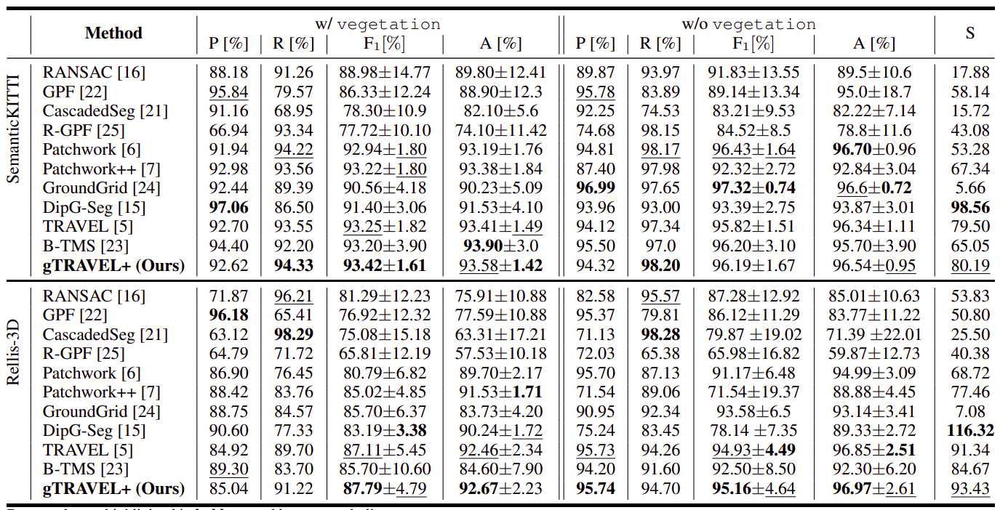

# gTRAVEL+: Enhancing Ground Segmentation using 3D LiDAR with Temporal Noise Removal and Adaptive Plane Fitting for Urban and Off-Road Environments
gTRAVEL+ is an improvement of [**TRAVEL**](https://github.com/url-kaist/TRAVEL) that focuses exclusively on enhancing ground segmentation performance.  
## 🔍 Overview  

gTRAVEL+ introduces:  
- **Temporal Node-Wise Noise Removal (TNNR)** to eliminate noise.  
- **Merge Node Plane Fitting (MNPF)** to tackle the under-segmentation issue caused by inappropriate region size.  
- **Rejected Ground Node Revert (RNGR)** to recover misclassified ground points. 
## :gear: How to build gTRAVEL+
1. **Dependencies**  
You need to install all the dependencies of the baseline method [**TRAVEL**](https://github.com/url-kaist/TRAVEL).
2. **Build**  
To successfully build gTRAVEL+, you can follow the commands below:
```bash
$ mkdir -p catkin_ws/src
$ cd catkin_ws/src
$ git clone https://github.com/giangdao1402/gTRAVEL-plus
$ ../
$ catkin build  # or catkin_make
```
## :running: How to run gTRAVEL+
```bash
$ cd catkin_ws
$ source devel/setup.bash
$ roslaunch gtravelp run_rellis.launch data_dir:=/media/giang/SSD/rosbag/SematicKITTI/Rellis_3D_os1_cloud_node_kitti_bin/Rellis-3D/00000 rviz:=True
 # or run_kitti.launch with data_dir of kitti bin
```

## 📊 Results  
This method achieves **state-of-the-art segmentation** performance on urban (SemanticKITTI) and off-road (Rellis-3D) datasets.
  
## Citation
If you use our codes, please consider citing our paper.
```
@ARTICLE{10990224,
  author={Dao, Truong Giang and Tran, Dinh Tuan and Nguyen, Duc Manh and Lee, Joo-Ho and Nguyen, Anh Quang},
  journal={IEEE Access}, 
  title={gTRAVEL+: Enhancing Ground Segmentation for 3D Point Cloud With Temporal Noise Removal and Adaptive Plane Fitting for Urban and Off-Road Environments}, 
  year={2025},
  volume={13},
  number={},
  pages={82431-82440},
  doi={10.1109/ACCESS.2025.3567621}}
```
## Acknowledgement
We would like to thank the authors of [**Patchwork**](https://github.com/limHyungTae/patchwork/), [**Patchwork++**](https://github.com/url-kaist/patchwork-plusplus) and [**TRAVEL**](https://github.com/url-kaist/TRAVEL) for their invaluable open-sourced code
